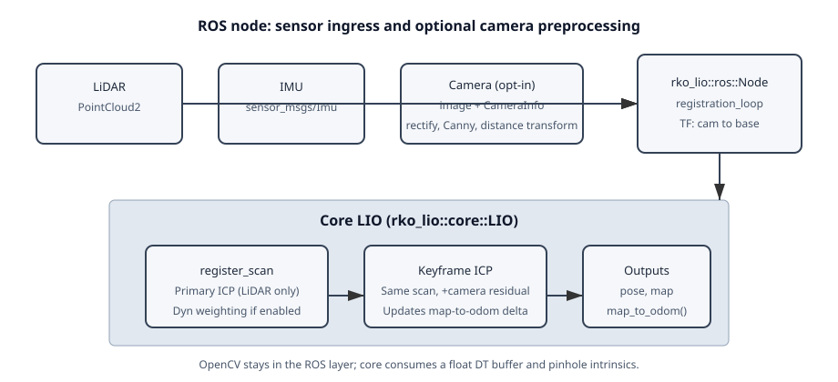
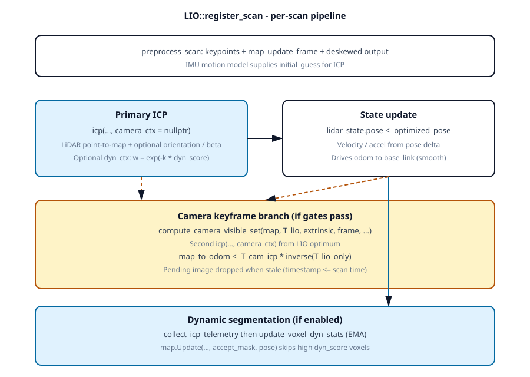
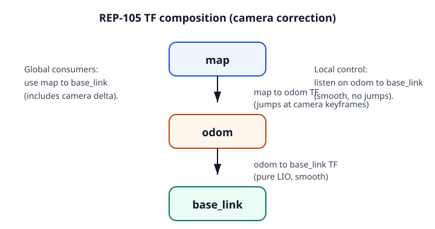
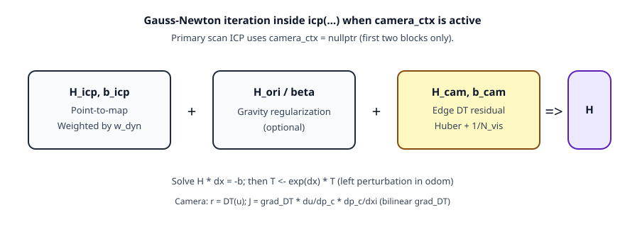
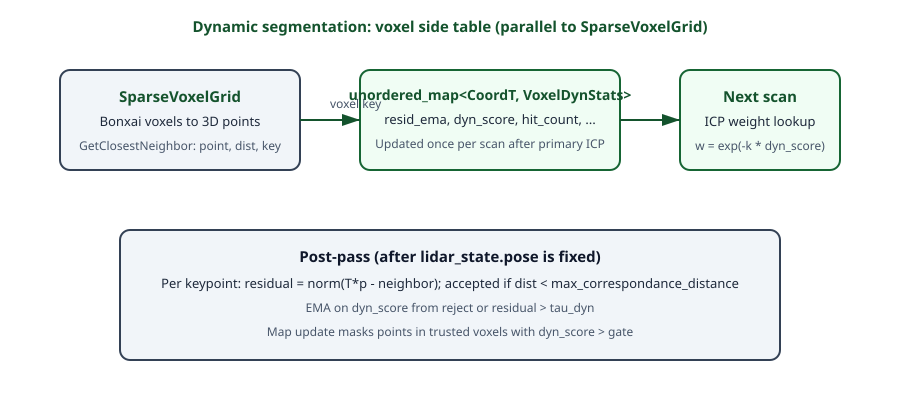

Camera tight coupling and dynamic-point segmentation
=====================================================

This page documents and derives the two **opt-in** additions to the core LIO
pipeline. They can be enabled independently or together. Defaults keep the
published odometry path unchanged.

What is implemented (summary)
-------------------------------

**Camera (monocular edge alignment)**

- ROS receives ``sensor_msgs/Image`` + ``CameraInfo``, rectifies, runs Canny +
  ``cv::distanceTransform``, and forwards a ``CameraFrame`` (float DT buffer +
  intrinsics + stamp) into ``LIO::add_camera_frame``.
- **Primary** scan registration still runs ``icp`` **without** the camera block
  so ``odom -> base_link`` stays purely LiDAR–inertial and smooth (REP-105).
- On **camera keyframes** (motion / rotation / time gates + minimum visible
  projected map points), a **second** ``icp`` is started from the LIO optimum
  with the camera residual enabled. The rigid correction
  :math:`T_{\mathrm{cam}} T_{\mathrm{lio}}^{-1}` is stored as ``map -> odom``.
- Core stays **OpenCV-free**; only the ROS node links OpenCV.

**Dynamic-point segmentation**

- After the primary ICP converges, ``collect_icp_telemetry`` walks all
  keypoints at the final pose and records per-voxel residuals / acceptance.
- A side ``std::unordered_map<Bonxai::CoordT, VoxelDynStats>`` (owned by
  ``LIO``, parallel to the voxel grid) is updated with EMA statistics.
- Next-scan ICP downweights correspondences whose voxels have high
  ``dyn_score``; ``SparseVoxelGrid::Update`` can mask out dynamic returns from
  entering the map; the camera visible-set pass skips high-``dyn_score`` voxels.
- Optional ROS split of the deskewed scan into static / dynamic topics.

Architecture figures
--------------------

The diagrams below are SVG files in ``docs/_static/``. They are written as
**strict XML** (ASCII text, no raw ``&`` characters, inline attributes only) so
desktop image viewers, browsers, and Sphinx can open them reliably.

   Sensor ingress: LiDAR and IMU always drive ``register_scan``; the camera path
   preprocesses edges in the ROS layer and hands a compact buffer to core.

   Per-scan ordering inside ``LIO::register_scan``: primary ICP updates state;
   optional keyframe ICP updates ``map -> odom``; dynamic telemetry runs after
   pose is fixed and gates ``map.Update``.

   REP-105 style split: ``odom -> base_link`` is smooth LIO; ``map -> odom``
   absorbs camera corrections at keyframes.

   Gauss–Newton iteration inside ``icp`` when ``camera_ctx`` is non-null (only
   the keyframe solve). The primary scan ICP omits the yellow block entirely.

   Dynamic statistics live beside the map; telemetry is collected **after** the
   primary ICP pose is known, then fed into the next scan's weighting and map
   insertion mask.

Conventions
-----------

We follow the same notation as the rest of the codebase: ``transform_from2to``
means a transformation that maps a vector expressed in the ``<from>`` frame to
the ``<to>`` frame, i.e. ``v_to = T_from2to * v_from``.

For the camera derivation:

- :math:`T = {}^{\mathrm{odom}}T_{\mathrm{base}}`: pose of the base frame in
  odom, the pose being optimized by ``icp``. ``current_pose`` in code.
- :math:`E = {}^{\mathrm{base}}T_{\mathrm{cam}}`: fixed extrinsic from camera
  to base, configured once from tf2 or a YAML.
- :math:`K`: pinhole intrinsic matrix
  :math:`\mathrm{diag}(f_x, f_y, 1)` with principal point :math:`(c_x, c_y)`.
  We use rectified images and rectified ``CameraInfo``; the lens distortion
  is handled in the ROS layer.
- :math:`\pi(p) = (p_x / p_z, p_y / p_z)` is the perspective projection.

ICP perturbs ``current_pose`` via a left-multiplied increment in ``odom``:
:math:`T \leftarrow \exp(\delta\xi) T`. This convention is fixed by
``build_icp_linear_system`` in ``rko_lio/core/lio.cpp`` and is reused for the
camera residual so the three Hessian blocks (ICP, orientation regularization,
camera) can be summed without sign reconciliation.

Camera edge-alignment residual
------------------------------

Image preprocessing (done **once per image** in the ROS layer, not per ICP
iteration):

1. Rectify with ``CameraInfo``.
2. Run Canny edge detection.
3. Compute the unsigned :math:`L_2` distance transform :math:`DT(u, v)`. For
   any pixel :math:`(u, v)`, :math:`DT(u, v)` is the distance to the nearest
   Canny edge, in pixels. It is smooth almost everywhere and admits a
   bilinear gradient :math:`\nabla DT(u, v)` away from the medial axis.

Per visible map point :math:`p_o \in \mathrm{odom}`:

.. math::

   p_c &= (E^{-1} T^{-1}) \, p_o
   = {}^{\mathrm{cam}}T_{\mathrm{odom}} \, p_o \\
   u   &= \pi(K p_c)
   = \left( f_x \frac{p_{c,x}}{p_{c,z}} + c_x,\;
            f_y \frac{p_{c,y}}{p_{c,z}} + c_y \right) \\
   r_i &= DT(u_i)

The residual is scalar, so each map point contributes a :math:`1 \times 6`
Jacobian :math:`J_i`.

Jacobian
^^^^^^^^

With left perturbation :math:`T \leftarrow \exp(\delta\xi)\,T` in the odom
frame (the same convention used by ``build_icp_linear_system`` in
``rko_lio/core/lio.cpp``), :math:`T^{-1} \leftarrow T^{-1}\,\exp(-\delta\xi)`
so the map point is left-multiplied by :math:`\exp(-\delta\xi)` before being
transformed into the camera. Define
:math:`R_{\mathrm{odom}\to\mathrm{cam}}
= R(E^{-1})\,R(T^{-1})
= R\!\left((T E)^{-1}\right)`.

Then:

.. math::

   \frac{\partial p_c}{\partial \delta\xi}
   = R_{\mathrm{odom}\to\mathrm{cam}}
   \begin{bmatrix} -I_{3 \times 3} & [p_o]_\times \end{bmatrix}

where :math:`[\cdot]_\times` is the skew-symmetric matrix and the layout is
:math:`\delta\xi = (\delta\rho, \delta\phi)` (translation first, rotation
second), matching the Sophus convention used in ``rko_lio/core/lio.cpp``.
The constant translation parts of :math:`E^{-1}` and :math:`T^{-1}` drop
out because the perturbation enters multiplicatively only on the rotation
of :math:`T^{-1}`.

The projection Jacobian for a pinhole camera is:

.. math::

   \frac{\partial u}{\partial p_c}
   = \frac{1}{p_{c,z}}
   \begin{bmatrix}
   f_x & 0   & -f_x \, p_{c,x} / p_{c,z} \\
   0   & f_y & -f_y \, p_{c,y} / p_{c,z}
   \end{bmatrix}

Combining:

.. math::

   J_i = \nabla DT(u_i) \cdot
         \frac{\partial u}{\partial p_c} \cdot
         \frac{\partial p_c}{\partial \delta\xi}
   \in \mathbb{R}^{1 \times 6}

with :math:`\nabla DT(u_i)` bilinearly sampled from the precomputed DT image.

The linear system contribution per point is

.. math::

   H_{\mathrm{cam},i} = J_i^\top J_i, \qquad
   b_{\mathrm{cam},i} = J_i^\top r_i.

Robust weighting
^^^^^^^^^^^^^^^^

Each point receives a Huber-style weight :math:`\rho(r_i)`. Defaults:

- Clip :math:`|r_i|` to ``camera_max_dt_residual_px`` (default 20 pixels) so
  catastrophic associations at cold start cannot dominate.
- Apply a Huber kernel with threshold equal to half the clip.

The aggregated system is normalized by the number of visible points and
multiplied by ``camera_weight`` :math:`\alpha`:

.. math::

   H_{\mathrm{cam}} = \frac{\alpha}{N_{\mathrm{vis}}}
   \sum_i \rho(r_i)^2 \, H_{\mathrm{cam},i},
   \qquad
   b_{\mathrm{cam}} = \frac{\alpha}{N_{\mathrm{vis}}}
   \sum_i \rho(r_i)^2 \, b_{\mathrm{cam},i}.

If :math:`N_{\mathrm{vis}} <` ``camera_min_visible_points`` the camera block
is disabled for this scan (yields ``H = 0, b = 0``).

Integration with ICP
^^^^^^^^^^^^^^^^^^^^

Inside ``icp(...)`` each Gauss–Newton iteration sums the same blocks as today,
plus the camera block **only when** ``camera_ctx`` is fully populated::

   auto [H_icp, b_icp, chi_icp] = build_icp_linear_system(..., dyn_ctx);
   auto [H_ori, b_ori, chi_ori] = build_orientation_linear_system(...);
   H = H_icp + H_ori / beta;
   b = b_icp + b_ori / beta;
   if (camera_active) {
     auto [H_cam, b_cam, chi_cam] = build_camera_edge_linear_system(...);
     H += H_cam;
     b += b_cam;
   }

**Primary scan registration** passes ``camera_ctx = nullptr``, so the camera
lines never run and the solver matches the historical RKO-LIO behavior.

**Keyframe registration** reuses the same ``icp`` entry point with
``camera_ctx`` wired to the precomputed visible set and distance-transform
image. That second solve starts from the LIO-only optimum and is what
produces the ``map -> odom`` delta described below.

Dynamic weighting (when ``dynamic_segmentation_enabled``) is applied inside
``build_icp_linear_system`` via an optional ``DynWeightingContext`` pointer;
when null, per-point weights are identically one.

Visible-point culling
^^^^^^^^^^^^^^^^^^^^^

To keep the inner ICP loop cheap, we collect the visible map points **once
per scan** at the predicted pose, before entering the iteration loop:

- Iterate the Bonxai voxel grid; for each voxel take its representative
  point (the centroid of stored points).
- Project to camera frame; cull points with :math:`p_{c,z} <`
  ``camera_min_point_depth_m`` or with :math:`u` outside the image rect.
- Optionally apply a low-resolution z-buffer at
  :math:`1 / \text{camera\_zbuf\_downsample}` resolution. A point is kept
  only if its depth is within tolerance of the buffer at its pixel.

The resulting list of ``(p_o, voxel_key)`` is reused unchanged across all
Gauss-Newton iterations of the current scan.

Dynamic-point segmentation
--------------------------

ICP converges globally on a single 6-DoF pose, so there is no literal
"per-voxel convergence". Instead we use **post-convergence telemetry**: once the
primary ICP has finished, ``collect_icp_telemetry`` evaluates every keypoint at
the final pose and records distance to the closest map neighbor plus whether
that neighbor was inside ``max_correspondance_distance``. High residuals or
rejected matches are treated as evidence that the **map voxel** associated with
the neighbor is dynamic-prone. This matches the intuition "static structure
explains the scan; moving structure does not" without claiming per-voxel ICP
iterates on its own.

Side-table layout
^^^^^^^^^^^^^^^^^

We keep a side hash table parallel to ``SparseVoxelGrid`` (no change to
``VoxelBlock``):

.. code-block:: cpp

   struct VoxelDynStats {
     float    resid_ema      = 0.f;
     float    dyn_score      = 0.f;
     uint16_t hit_count      = 0;
     uint16_t miss_count     = 0;
     uint32_t last_seen_scan = 0;
   };

   std::unordered_map<Bonxai::CoordT, VoxelDynStats, CoordTHash> voxel_dyn;

This is owned by ``LIO`` and updated only when
``dynamic_segmentation_enabled = true``.

EMA update
^^^^^^^^^^

For each telemetry row with residual :math:`r_i` and "accepted" flag
:math:`a_i` (true iff the neighbor distance is below
``max_correspondance_distance``), the matched voxel's stats are updated as:

.. math::

   \mathrm{resid\_ema} \leftarrow
   (1 - \alpha_d) \cdot \mathrm{resid\_ema} + \alpha_d \cdot r_i

   \mathrm{dyn\_score} \leftarrow
   (1 - \alpha_d) \cdot \mathrm{dyn\_score} +
   \alpha_d \cdot \mathbb{1}\big[r_i > \tau_{\mathrm{dyn}}\;\vee\;\neg a_i\big]

with :math:`\alpha_d =` ``dyn_ema_alpha``. ``hit_count`` is incremented and
``last_seen_scan`` is updated.

Voxels with ``hit_count < dyn_min_hits_to_trust`` are not trusted yet (newly
observed surfaces look "dynamic" until the EMA settles, and the gate handles
that gracefully).

Uses of ``dyn_score``
^^^^^^^^^^^^^^^^^^^^^

In priority order:

1. **Map cleanup**: scan points whose voxel has ``dyn_score >
   dyn_skip_map_score`` are dropped from ``SparseVoxelGrid::Update``. This
   prevents dynamic returns from polluting the map.
2. **ICP weighting (next scan)**: multiply per-point Jacobian and residual
   contributions in ``build_icp_linear_system`` by
   :math:`w_i = \exp(-k \cdot \mathrm{dyn\_score})` with ``k =
   dyn_weight_decay_k``. Self-reinforcing.
3. **Camera mask**: in the visible-point pre-pass for the camera residual,
   drop voxels whose ``dyn_score > dyn_skip_map_score``. Keeps moving cars
   and pedestrians out of the camera alignment.
4. **Publishing**: optionally split the deskewed scan into separate topics when
   ``publish_dynamic_split`` is true (see :doc:`./ros/usage`).

Limitations
^^^^^^^^^^^

- **Ego-velocity-matched objects** (adjacent-lane vehicle at the same speed)
  produce small relative residuals and are labeled static. Residual-only
  methods cannot detect them; visibility-based ray-casting
  (Removert / Dynablox / ERASOR) is the path forward and is queued for v2.
- **Miscalibrated extrinsics** inflate ``resid_ema`` globally and can
  produce spurious dynamic labels. The ``hit_count`` gate plus the
  per-voxel EMA mitigate transient noise.
- **Newly observed surfaces** transiently look dynamic. The
  ``dyn_min_hits_to_trust`` gate prevents premature classification.

Map-frame correction propagation
--------------------------------

When a camera keyframe is accepted, the second ICP optimum
:math:`T_{\mathrm{cam}}` (with camera residual) is compared to the LIO-only
optimum :math:`T_{\mathrm{lio}}` at the **same** scan:

.. math::

   \Delta T = T_{\mathrm{cam}} \cdot T_{\mathrm{lio}}^{-1}

``LIO`` stores :math:`\Delta T` as ``map_to_odom()`` and the ROS node may
broadcast it as ``map -> odom`` (REP-105). The ``odom -> base_link`` chain
remains exactly the primary LiDAR output (smooth, never jumps);
``map -> base_link`` inherits the camera correction via TF composition. The
local voxel map stays expressed in ``odom``; we do not warp stored points when
:math:`\Delta T` updates.

Config keys
-----------

Defaults shown.

Camera:

.. code-block:: yaml

   camera_enabled: false
   camera_weight: 1.0
   camera_max_dt_residual_px: 20.0
   camera_min_visible_points: 200
   camera_min_point_depth_m: 0.5
   camera_use_occlusion_zbuf: true
   camera_zbuf_downsample: 4
   camera_warmup_scans: 5

Dynamic segmentation:

.. code-block:: yaml

   dynamic_segmentation_enabled: false
   dyn_tau_static_m: 0.10
   dyn_tau_dynamic_m: 0.30
   dyn_ema_alpha: 0.20
   dyn_skip_map_score: 0.60
   dyn_weight_decay_k: 4.0
   dyn_min_hits_to_trust: 3

References
----------

- VLOAM / DEMO / LIMO: depth-from-LiDAR for monocular visual odometry.
- KISS-ICP and Kinematic-ICP: ICP backbone that RKO-LIO inherits.
- Removert, Dynablox, ERASOR: visibility-based dynamic map carving
  (queued for v2 of dynamic segmentation).
